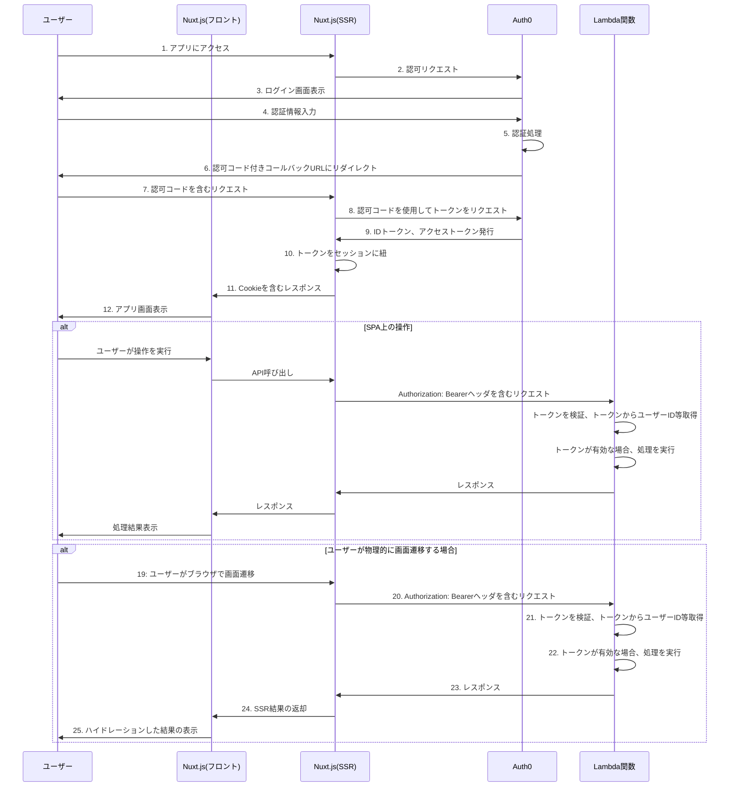

```mermaid
sequenceDiagram
    participant User as ユーザー
    participant Front as Nuxt.js(フロント)
    participant Server as Nuxt.js(SSR)
    participant Auth0 as Auth0
    participant Lambda as Lambda関数

    User->>Server: 1. アプリにアクセス
    Server->>Auth0: 2. 認可リクエスト
    Auth0->>User: 3. ログイン画面表示
    User->>Auth0: 4. 認証情報入力
    Auth0->>Auth0: 5. 認証処理
    Auth0->>User: 6. 認可コード付きコールバックURLにリダイレクト
    User->>Server: 7. 認可コードを含むリクエスト
    Server->>Auth0: 8. 認可コードを使用してトークンをリクエスト
    Auth0->>Server: 9. IDトークン、アクセストークン発行
    Server->>Server: 10. トークンをセッションに紐
    Server->>Front: 11. Cookieを含むレスポンス
    Front->>User: 12. アプリ画面表示
    alt SPA上の操作
        User->>Front: ユーザーが操作を実行
        Front->>Server: API呼び出し
        Server->>Lambda: Authorization: Bearerヘッダを含むリクエスト
        Lambda->>Lambda: トークンを検証、トークンからユーザーID等取得
        Lambda->>Lambda: トークンが有効な場合、処理を実行
        Lambda->>Server: レスポンス
        Server->>Front: レスポンス
        Front->>User: 処理結果表示
    end
    alt ユーザーが物理的に画面遷移する場合
        User->>Server: 19: ユーザーがブラウザで画面遷移
        Server->>Lambda: 20. Authorization: Bearerヘッダを含むリクエスト
        Lambda->>Lambda: 21. トークンを検証、トークンからユーザーID等取得
        Lambda->>Lambda: 22. トークンが有効な場合、処理を実行
        Lambda->>Server: 23. レスポンス
        Server->>Front: 24. SSR結果の返却
        Front->>User: 25. ハイドレーションした結果の表示
    end
```
