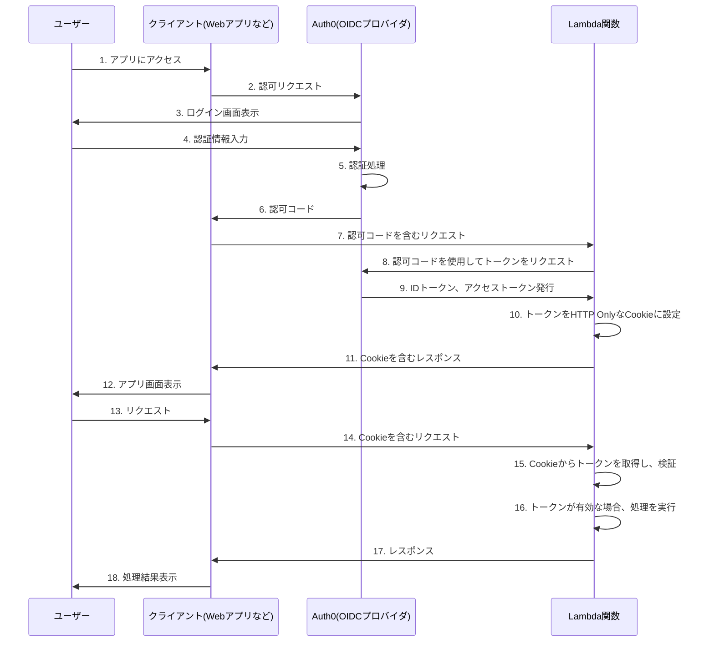

```mermaid
sequenceDiagram
    participant User as ユーザー
    participant Client as クライアント(Webアプリなど)
    participant Auth0 as Auth0(OIDCプロバイダ)
    participant Lambda as Lambda関数

    User->>Client: 1. アプリにアクセス
    Client->>Auth0: 2. 認可リクエスト
    Auth0->>User: 3. ログイン画面表示
    User->>Auth0: 4. 認証情報入力
    Auth0->>Auth0: 5. 認証処理
    Auth0->>Client: 6. 認可コード
    Client->>Lambda: 7. 認可コードを含むリクエスト
    Lambda->>Auth0: 8. 認可コードを使用してトークンをリクエスト
    Auth0->>Lambda: 9. IDトークン、アクセストークン発行
    Lambda->>Lambda: 10. トークンをHTTP OnlyなCookieに設定
    Lambda->>Client: 11. Cookieを含むレスポンス
    Client->>User: 12. アプリ画面表示
    User->>Client: 13. リクエスト
    Client->>Lambda: 14. Cookieを含むリクエスト
    Lambda->>Lambda: 15. Cookieからトークンを取得し、検証
    Lambda->>Lambda: 16. トークンが有効な場合、処理を実行
    Lambda->>Client: 17. レスポンス
    Client->>User: 18. 処理結果表示
```
